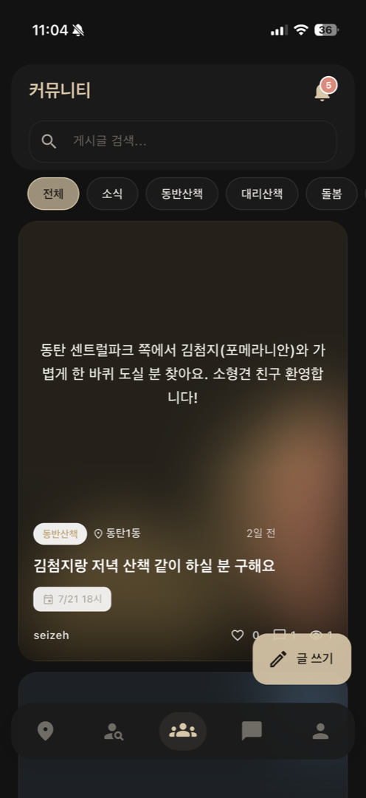
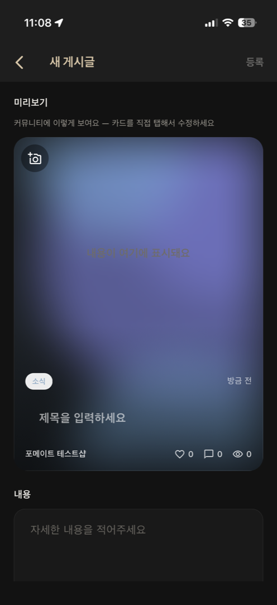
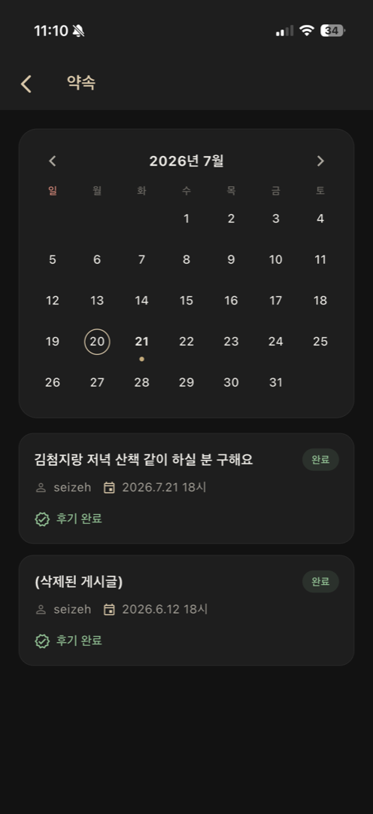
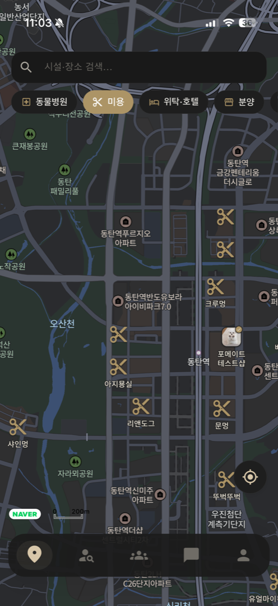
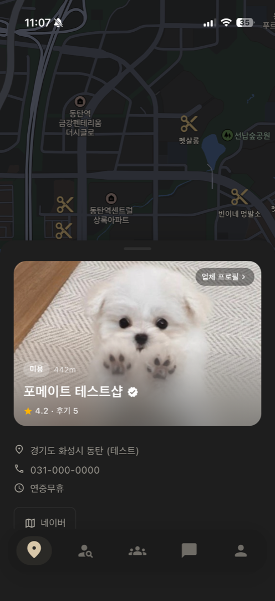
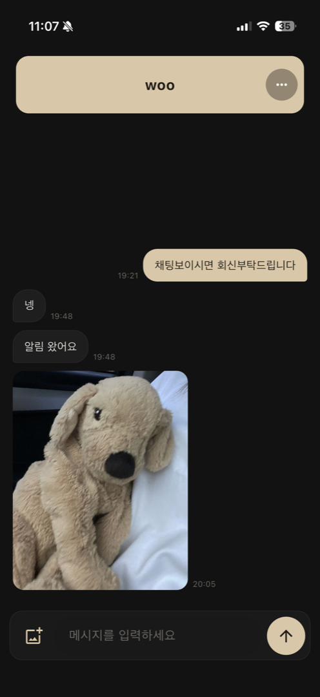
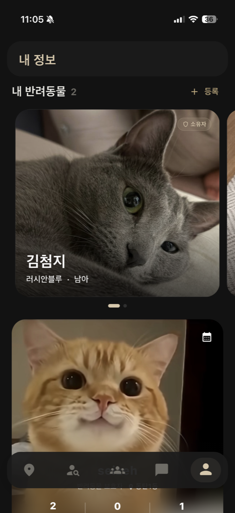
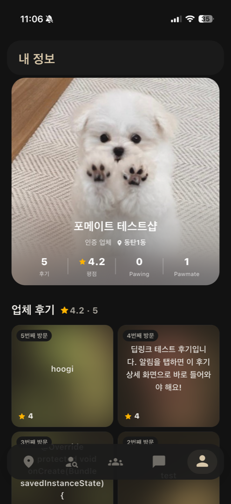
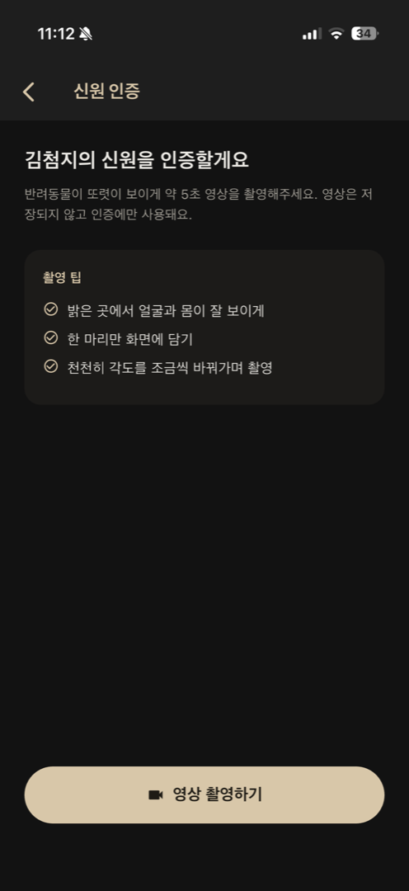
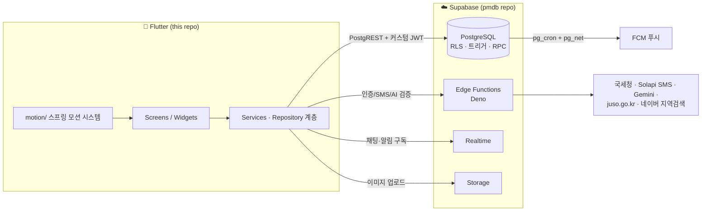

# 🐾 PawMate

[](https://github.com/seizeh/pmdart/actions/workflows/ci.yml)
[](https://github.com/seizeh/pmdart/actions/workflows/deploy-web.yml)

**동네 기반 반려동물 산책·돌봄 매칭 & 커뮤니티** — Flutter(iOS · Android · Web) + Supabase

GPS 동네 인증을 기반으로 이웃과 반려동물 산책 메이트를 찾고, 돌봄·분양·입양을 매칭하며,
주변 반려동물 시설을 지도에서 찾아 후기를 나누는 하이퍼로컬 서비스입니다.

> ### 🌐 지금 바로 보기 — **<https://app.pawmate.kr>**
>
> 첫 화면의 **"로그인 없이 둘러보기"** 로 가입 없이 피드·지도·시설 후기를 볼 수 있습니다.
> (글쓰기·채팅 등 쓰기 동작은 전화 인증이 필요합니다. 모바일 앱은 스토어 출시 준비 중)

## 왜 만들었나

반려동물 분양 경로 **1위는 펫숍(28.7%)이 아니라 지인(46.0%)** 이다(농림축산식품부,
2025). 이 시장의 주류 거래는 이미 이웃·지인 사이에서 일어나는데, 그걸 지원하는 서비스가
없어서 사람들은 맘카페·중고거래 게시판에서 거래한다 — 상대도 그 동물도 확인할 방법이
없는 곳에서.

기존 펫시터 플랫폼은 **회사가 공급자를 심사**해 이 문제를 푼다(신원·면접·범죄이력).
확실하지만 **이웃 간 거래에는 쓸 수 없다** — 옆집 사람을 회사가 면접할 수는 없다.

> **회사가 사람을 심사할 수 없는 P2P 에서, 신뢰를 어떻게 만들 것인가?**

이 질문이 설계의 중심이다. 사람을 심사하는 대신 **행위와 대상을 검증한다** —
지역 인증, AI 개체 대조, 상호 후기. 전부 클라이언트가 아니라 서버가 강제한다.

같은 문제가 **시설 선택**에서도 반복된다. 동네 병원·미용실 후기는 범용 지도 서비스에
있지만 작성자가 그 동네 사람인지, 실제로 갔는지 알 수 없다. 그래서 시설 원장은
**공공데이터**에서 가져오고, 후기에는 전화 인증을 요구하며(가입 전 사용자는 **후기
한 건마다 재인증**), 업체는 **국세청 계속사업자 확인**을 통과해야 자기 시설을 운영한다.
반려동물 매칭과 시설 후기를 한 앱에서 다루는 서비스는 조사한 범위에 없었다.

문제 정의·기존 서비스 비교·검증 계획: **[docs/problem-statement.md](docs/problem-statement.md)**

## 스크린샷

| 커뮤니티 피드 | 게시글 작성 (WYSIWYG) | 약속 캘린더 |
|:---:|:---:|:---:|
|  |  |  |

| 시설 지도 | 시설 상세 (인증 업체) | 채팅 |
|:---:|:---:|:---:|
|  |  |  |

| 내 정보 (펫 히어로) | 업체 모드 (두 얼굴) | AI 신원 인증 |
|:---:|:---:|:---:|
|  |  |  |

---

## 엔지니어링

기능 목록보다 이 절이 저장소의 요점입니다. 아래는 전부 **CI 에서 강제**되며,
각각 실제로 당한 사고가 있어서 만든 장치입니다.

| 장치 | 무엇을 막나 | 위치 |
|---|---|---|
| **`dart:io` 금지 게이트** | 웹에서 **컴파일은 되지만** `Platform.isIOS` 등이 런타임에 `UnsupportedError` 를 던진다 — 빌드로는 안 잡히고 흰 화면으로만 드러난다 | [`ci.yml`](.github/workflows/ci.yml) |
| **마이그레이션 리플레이** | 빈 DB 에 마이그레이션 175건을 처음부터 재생해 운영 스냅샷과 대조 — **마이그레이션 없이 운영 DB 에 직접 친 DDL 이 즉시 빨간불** | [`pmdb/db-tests.yml`](https://github.com/seizeh/pmdb/blob/main/.github/workflows/db-tests.yml) |
| **pgTAP 불변식 16종** | 자기초대 차단·팔로우 얼굴 분리·채팅 삭제 권한 등을 **DB 레벨**에서 검증(클라이언트가 아니라) | [`pmdb/tests/`](https://github.com/seizeh/pmdb/tree/main/supabase/tests) |
| **커버리지 래칫 (≥12%)** | 달성 못 할 80% 를 적어 두는 대신 **현재값을 하한으로 고정** — 떨어지면 실패 | [`ci.yml`](.github/workflows/ci.yml) |
| **`catch (_)` 래칫 (≤144)** | 예외를 삼킨 판단이 런타임에 흔적을 안 남기는 것 — 세 등급 중 하나를 쓰게 강제한다([정책](docs/error-policy.md)) | [`ci.yml`](.github/workflows/ci.yml) |
| 웹 빌드 게이트 | 앱 변경이 웹 번들을 조용히 깨는 것 | [`ci.yml`](.github/workflows/ci.yml) |
| 포맷·정적 분석 | `dart format --set-exit-if-changed`, `flutter analyze` | [`ci.yml`](.github/workflows/ci.yml) |

**규모** — Dart 48,869줄(화면 59개) · 마이그레이션 175건 · Edge Functions 20개 ·
테이블 50 · RLS 정책 76 · 트리거 73 · DB 함수 180

### 알려진 한계

직접 진단해 티켓으로 남긴 것들입니다. 감추지 않는 편이 정확합니다.

| 부채 | 현황 |
|---|---|
| **관측성** | 3등급 정책과 리포팅 경로를 세웠다([error-policy.md](docs/error-policy.md)). 등급화가 남은 `catch (_)` 144곳은 CI 래칫으로 줄이는 중 ([#157](https://github.com/seizeh/pmdart/issues/157)) |
| **God Widget** | 1,000줄 넘는 화면 8개(최대 2,065줄) ([#155](https://github.com/seizeh/pmdart/issues/155)) |
| **상태관리·DI** | 프레임워크 없이 `ChangeNotifier` 홀더로 점진 전환 중(59개 중 6개) ([#156](https://github.com/seizeh/pmdart/issues/156) · [ADR-0008](docs/adr/0008-state-holders-without-framework.md)) |
| 커버리지 12% | 위 구조의 결과. 래칫으로 하한만 지키는 중 ([#158](https://github.com/seizeh/pmdart/issues/158)) |
| i18n 미도입 | 하드코딩 한글 문자열 ([#159](https://github.com/seizeh/pmdart/issues/159)) |

## 설계 결정 기록 (ADR) — [docs/adr/](docs/adr/)

왜 그렇게 만들었는지, 그리고 **그 선택의 대가로 무엇을 밟았는지** 를 10건으로 남겼습니다.
대부분 **증상과 원인이 멀어서** 기록해 둘 가치가 있었던 것들입니다.

| 결정 | 무엇을 밟았나 |
|---|---|
| [Supabase Auth 대신 커스텀 인증](docs/adr/0001-custom-phone-auth.md) | 무상태 JWT 라 **정지시킨 사용자가 30일간 계속 접근**됐다 |
| [불변식은 DB 에서 강제](docs/adr/0002-invariants-in-db.md) | 함수는 막고 있었지만 **PostgREST 직접 INSERT 로 뚫렸다** |
| [DEFINER 객체에 쓰기 경로 금지](docs/adr/0003-definer-view-write-paths.md) | 공개 anon 키만으로 **로그인 없이 관리자 승격**이 가능했다(실증 확인) |
| [RLS 비가시 행 쓰기](docs/adr/0004-rls-invisible-rows.md) | 소프트 삭제가 42501. INVOKER RPC 는 **에러 없이 NULL** 을 돌려준다 |
| [마이그레이션 리플레이](docs/adr/0005-db-change-management.md) | 켜자마자 **재정의로 유실된 알림 필터**가 잡혔다 |
| [`dart:io` CI 금지](docs/adr/0006-web-port-dart-io-gate.md) | 컴파일은 되는데 런타임에 흰 화면 |

전체 10건과 형식은 [docs/adr/README.md](docs/adr/README.md).

---

## 주요 기능

| 영역 | 내용 |
|---|---|
| 🏘️ 동네 인증 | GPS + 행정동 역지오코딩 기반 지역 인증(30일 주기 재인증) — 모든 게시글·피드가 인증 동네 기준 |
| 🐕 매칭 | 동반산책 / 대리산책 / 돌봄 / 분양 / 입양 게시글 → 지원 → 수락 → 약속 → 상호 후기 |
| 📸 AI 사진 인증 | 반려동물 신원 인증(영상 등록) + 게시글 사진 실존 검증(AI 개체 대조·위치 검증) — 허위 매물 차단 |
| 🗺️ 시설 지도 | 네이버 지도 기반 반려동물 시설(병원·카페 등) 탐색, 방문 후기·별점·후기 댓글 |
| 🏪 업체 계정 | 사업자 인증(국세청 조회 + 공공데이터 대조 자동승인) — 한 계정에 개인/업체 **두 얼굴** 분리 |
| 💬 채팅 | 1:1 실시간 채팅(Realtime), 사진 전송, 메시지 삭제(30일 유예 파기), 업체 문의 분리 |
| 🔔 알림 | FCM 푸시 + 인앱 실시간 알림, 탭 시 해당 화면 직행 딥링크, 유형별 수신 설정 |
| 👥 소셜 | 팔로우(Pawing/Pawmate — 개인·업체 얼굴 독립), 사용자·반려동물·상호 검색 |

## 아키텍처



- **인증**: 전화번호 OTP 기반 커스텀 인증(HS256 JWT + refresh 토큰). Supabase Auth 미사용 —
  모든 RLS 가 `app.uid()`(JWT sub) 기준으로 동작합니다. → [ADR-0001](docs/adr/0001-custom-phone-auth.md)
- **보안 원칙**: 클라이언트에는 publishable 키만. 쓰기 검증이 필요한 작업은
  SECURITY DEFINER RPC / DB 트리거가 최종 강제(클라이언트 검증은 UX 용).
  → [ADR-0002](docs/adr/0002-invariants-in-db.md) · [ADR-0003](docs/adr/0003-definer-view-write-paths.md)
- **모션**: `lib/motion/` 의 스프링 프리미티브(Pressable·Entrance·CollapseRoute 등)를
  전 화면이 공유 — 카드 확장/축소, 쓸어내려 닫기 등 일관된 전환 언어.

## 저장소 구조

```
lib/
  main.dart          # 앱 초기화 · 푸시/딥링크 라우팅
  screen/            # 화면 (tabs/ 메인 5탭, admin/ 관리자)
  services/          # Supabase 접근 리포지토리 · 푸시 · 실시간 · 위치
  state/             # 화면 상태 홀더 (ChangeNotifier — docs/architecture-state.md)
  models/            # 도메인 모델
  widgets/           # 공용 위젯 (피드 카드 · 타일 · 시트)
  motion/            # 스프링 모션 시스템 (전환 · 촉감 피드백)
  theme/             # 라이트/다크 팔레트 · 테마
  utils/             # platform_info · 조건부 import 파사드(웹 대응)
docs/
  adr/               # 설계 결정 기록
  web-port.md        # 웹 이식 설계·배포·검증 함정
  architecture-state.md  # 상태 홀더 패턴
test/                # 위젯·상태 홀더 테스트 (34개 파일)
```

## 관련 저장소

| 저장소 | 내용 |
|---|---|
| [**pmdb**](https://github.com/seizeh/pmdb) | Supabase 백엔드 — 마이그레이션 175건 · Edge Functions 20개 · pgTAP 16종 · 리플레이 CI · DB 전체 레퍼런스 문서 |
| [**pmlegal**](https://github.com/seizeh/pmlegal) | 서비스 이용약관 · 개인정보처리방침 · 위치기반서비스 약관 (정본) |

## 실행

```bash
# Flutter stable 채널 (Dart SDK ^3.12)
flutter pub get
flutter run          # 연결된 기기/시뮬레이터
flutter run -d chrome  # 웹

# 검사 & 테스트 (CI 와 동일)
dart format --output=none --set-exit-if-changed lib test
flutter analyze --no-fatal-infos
flutter test --coverage
```

- 지도·Supabase 등 클라이언트 공개 키는 `lib/env.dart` 의 기본값으로 동작하며,
  `--dart-define=SUPABASE_URL=...` 등으로 환경별 재정의할 수 있습니다.
- 주소검색(행안부 juso) 키는 쿼터 남용 여지가 있어 기본값 없이
  `--dart-define=JUSO_API_KEY=...` 로만 주입합니다 — 미설정 시 주소 검색만
  비활성화되고(수동 입력 폴백) 나머지 기능은 정상 동작합니다.
- 푸시(FCM/APNs)는 실기기 + 서명 설정이 필요합니다.

## 라이선스

[MIT](LICENSE)
