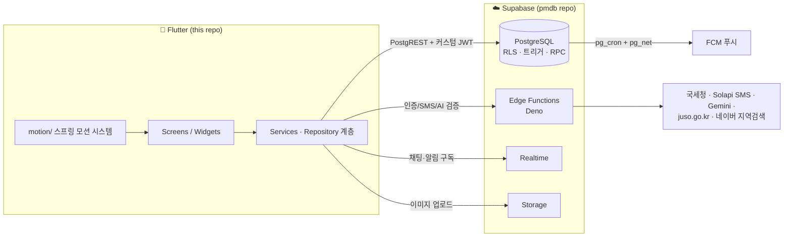

# 🐾 PawMate

[](https://github.com/seizeh/pmdart/actions/workflows/ci.yml)

**동네 기반 반려동물 산책·돌봄 매칭 & 커뮤니티 앱** (Flutter · iOS/Android)

GPS 동네 인증을 기반으로 이웃과 반려동물 산책 메이트를 찾고, 돌봄·분양·입양을 매칭하며,
주변 반려동물 시설을 지도에서 찾아 후기를 나누는 하이퍼로컬 서비스입니다.

## 스크린샷

| 커뮤니티 피드 | 게시글 작성 (WYSIWYG) | 약속 캘린더 |
|:---:|:---:|:---:|
|  |  |  |

| 시설 지도 | 시설 상세 (인증 업체) | 채팅 |
|:---:|:---:|:---:|
|  |  |  |

| 내 정보 (펫 히어로) | 업체 모드 (두 얼굴) | AI 신원 인증 |
|:---:|:---:|:---:|
|  |  |  |

## 주요 기능

| 영역 | 내용 |
|---|---|
| 🏘️ 동네 인증 | GPS + 행정동 역지오코딩 기반 지역 인증(30일 주기 재인증) — 모든 게시글·피드가 인증 동네 기준 |
| 🐕 매칭 | 동반산책 / 대리산책 / 돌봄 / 분양 / 입양 게시글 → 지원 → 수락 → 약속 → 상호 후기 |
| 📸 AI 사진 인증 | 반려동물 신원 인증(영상 등록) + 게시글 사진 실존 검증(AI 개체 대조·위치 검증) — 허위 매물 차단 |
| 🗺️ 시설 지도 | 네이버 지도 기반 반려동물 시설(병원·카페 등) 탐색, 방문 후기·별점·후기 댓글 |
| 🏪 업체 계정 | 사업자 인증(국세청 조회 + 공공데이터 대조 자동승인) — 한 계정에 개인/업체 **두 얼굴** 분리, 업체 소식 카테고리 |
| 💬 채팅 | 1:1 실시간 채팅(Realtime), 사진 전송, 메시지 삭제(30일 유예 파기), 업체 문의 분리 |
| 🔔 알림 | FCM 푸시 + 인앱 실시간 알림, 탭 시 해당 화면 직행 딥링크, 유형별 수신 설정 |
| 👥 소셜 | 팔로우(Pawing/Pawmate — 개인·업체 얼굴 독립), 사용자·반려동물·상호 검색 |

## 아키텍처



- **인증**: 전화번호 OTP 기반 커스텀 인증(HS256 JWT + refresh 토큰). Supabase Auth 미사용 —
  모든 RLS 가 `app.uid()`(JWT sub) 기준으로 동작합니다.
- **보안 원칙**: 클라이언트에는 publishable 키만. 쓰기 검증이 필요한 작업은
  SECURITY DEFINER RPC / DB 트리거가 최종 강제(클라이언트 검증은 UX 용).
  클라이언트 공개 키·식별자는 `lib/env.dart` 한곳에 모여 있으며
  `--dart-define` 으로 환경별 오버라이드할 수 있다(비밀 키는 서버 전용).
- **모션**: `lib/motion/` 의 스프링 프리미티브(Pressable·Entrance·CollapseRoute 등)를
  전 화면이 공유 — 카드 확장/축소, 쓸어내려 닫기 등 일관된 전환 언어.

## 저장소 구조

```
lib/
  main.dart          # 앱 초기화 · 푸시/딥링크 라우팅
  screen/            # 화면 (tabs/ 메인 5탭, admin/ 관리자, auth/ 인증)
  services/          # Supabase 접근 리포지토리 · 푸시 · 실시간 · 위치
  models/            # 도메인 모델
  widgets/           # 공용 위젯 (피드 카드 · 타일 · 시트)
  motion/            # 스프링 모션 시스템 (전환 · 촉감 피드백)
  theme/             # 라이트/다크 팔레트 · 테마
test/                # 위젯 테스트
```

## 관련 저장소

| 저장소 | 내용 |
|---|---|
| [pmdb](https://github.com/seizeh/pmdb) | Supabase 백엔드 — DB 마이그레이션(스키마·RLS·트리거·RPC 전체 레퍼런스 문서 포함) · Edge Functions |
| [pmlegal](https://github.com/seizeh/pmlegal) | 서비스 이용약관 · 개인정보처리방침 · 위치기반서비스 약관 (정본) |

## 실행

```bash
# Flutter stable 채널 (Dart SDK ^3.12)
flutter pub get
flutter run          # 연결된 기기/시뮬레이터

# 검사 & 테스트
flutter analyze
flutter test
```

- 지도·주소검색·Supabase 등 클라이언트 공개 키는 `lib/env.dart` 의 기본값으로 동작하며,
  `--dart-define=SUPABASE_URL=...` 등으로 환경별 재정의할 수 있습니다.
- 푸시(FCM/APNs)는 실기기 + 서명 설정이 필요합니다.
