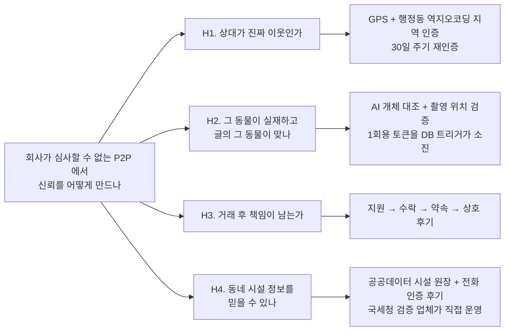

# 문제 정의와 기존 서비스 비교

> 조사 시점: 2026-07. 수치의 출처는 문서 끝 [참고](#참고)에 있다.

## 한 줄 요약

반려동물 관련 거래의 상당 부분은 **이미 이웃·지인 사이에서 일어나고 있다**. 그런데
그 거래를 지원하는 서비스는 없다 — 기존 플랫폼은 **회사가 검증한 소수의 전문 공급자**를
중개하는 모델이거나, 반려동물을 다루지 않는 범용 동네 커뮤니티다. PawMate 는 그 사이의
빈칸, **이웃 간(P2P) 반려동물 매칭**을 대상으로 하고, 그 모델에서 가장 어려운 문제인
**신뢰를 어떻게 만드느냐**에 기술적 비중을 둔다.

## 1. 문제 정의

### 1.1 대상

도시에 사는 반려동물 양육 가구 중, **일상적인 도움을 이웃에게서 구해야 하는 사람들**.

- 하루 두 번 산책이 필요한데 매일은 어려운 사람
- 1박 출장·병원 입원 등으로 며칠 돌봄이 비는 사람
- 반려동물을 분양·입양하려는 사람과 보내려는 사람
- 우리 동네의 병원·미용실이 실제로 어떤지 알고 싶은 사람

### 1.2 왜 지금인가

반려동물을 직접 양육하는 가구 비율은 **29.2%** 다(2025년, 가구방문 면접조사 3,000가구,
국가승인통계). "4가구 중 1가구" 에서 **"3가구 중 1가구"** 로 넘어온 시점이다.

그런데 정작 **반려동물을 어떻게 데려왔는가**를 보면 시장의 성격이 드러난다.

| 분양 경로 | 비율 |
|---|---:|
| **지인을 통한 분양(유료·무료)** | **46.0%** |
| 펫숍에서 구입 | 28.7% |
| 길고양이 등을 데려다 키움 | 9.0% |

**1위가 펫숍이 아니라 지인이다.** 즉 이 시장의 주류 거래는 이미 개인 간(P2P)에서
일어난다. 그런데 그 거래를 **지원하는 서비스가 없다** — 사람들은 맘카페·중고거래
게시판 같은, 이 목적에 맞게 설계되지 않은 곳에서 거래한다.

### 1.3 그래서 생기는 문제

목적에 맞지 않는 곳에서 거래하면 **상대를 확인할 방법이 없다.**

- 게시글의 사진이 **그 동물의 지금 모습인지** 알 수 없다(퍼온 사진·오래된 사진)
- 상대가 **정말 우리 동네 사람인지** 알 수 없다
- 문제가 생겨도 **책임을 물을 상대가 특정되지 않는다**

품종·혈통을 속인 분양, 책임비 명목의 불법 거래 같은 피해가 반복적으로 보도되는 이유다.
동물자유연대가 접수·분석한 사례에서는 피해자 1인당 평균 225만 원의 금전적 손실이
보고됐다.

같은 문제가 **시설 선택**에서도 반복된다. 동물병원·미용실은 한 번 잘못 고르면 되돌리기
어려운데, 판단 근거가 될 후기는 범용 지도 서비스에 흩어져 있다. 거기 후기는 **작성자가
누구인지·그 동네 사람인지·실제로 갔는지** 알 수 없고, 반려인이 정작 궁금한 것(어떤
진료를 보는지, 어떤 미용을 하는지)에 맞춰져 있지도 않다.

**정리하면 문제는 "매칭이 없다" 가 아니라 "매칭은 이미 일어나는데 신뢰 장치가 없다" 다.**
그리고 그 신뢰 문제는 사람(H1·H3), 동물(H2), **시설(H4)** 세 축에서 똑같이 나타난다.

## 2. 기존 서비스로 왜 안 되나

### 2.1 포지셔닝 비교

| | 지역 기반 | 반려동물 특화 | 이웃 간 매칭 | 시설 후기 | 신뢰를 만드는 방식 |
|---|:---:|:---:|:---:|:---:|---|
| **당근 동네생활** | ✅ | ❌ | ✅ | 범용 업체 | 동네 인증 + 매너온도(범용) |
| **네이버 지도 · 카카오맵** | ✅ | ❌ | ❌ | ✅(범용) | 없음 — 작성자의 지역·방문 여부 무관 |
| **펫프렌즈** | ❌ | ✅ | ❌ | ❌ | 판매자=회사 |
| **도그메이트 · 펫트너** | 부분 | ✅ | ❌(중개) | ❌ | **회사가 공급자를 심사**(신원·인적성·면접·범죄이력) |
| 맘카페 · 중고거래 게시판 | 부분 | ❌ | ✅ | ❌ | **없음** |
| **PawMate** | ✅ | ✅ | ✅ | **✅(반려동물 특화)** | 지역 인증 + AI 실존 검증 + 상호 후기 + 사업자 인증 |

반려동물 매칭과 시설 후기를 **한 앱 안에서** 다루는 서비스는 위에 없다. 둘은 사실
같은 사용자의 연속된 필요다 — 이웃에게 돌봄을 맡기는 사람과 동네 병원을 고르는 사람은
같은 사람이다.

### 2.2 각각이 남기는 빈칸

**당근 동네생활** — 동네 인증이라는 정확한 기반을 갖췄지만 범용 커뮤니티다. 반려동물
글은 다른 글과 같은 취급을 받고, 산책·돌봄·분양이라는 **거래 흐름**(지원 → 수락 → 약속
→ 상호 후기)이 없다. 매너온도는 거래 상대의 평판이지 **그 동물이 실재하는지**에 대한
정보가 아니다.

**펫프렌즈** — 반려동물 특화지만 **커머스**다. 사료·용품을 파는 곳이지 사람과 사람을
잇는 곳이 아니다.

**도그메이트 · 펫트너** — 가장 가까운 서비스지만 **모델이 다르다.** 이들은 회사가
펫시터를 신원 확인·인적성 검사·면접·범죄이력 조회로 심사해 중개한다(도그메이트는
2015년 이후 누적 3만 6천여 마리, 15만 건 이상의 방문 돌봄을 제공했고 2025년
커넥팅더닷츠에 인수됐다). 즉 **소수의 검증된 전문가 ↔ 다수의 이용자** 구조다.

이 방식은 신뢰 문제를 확실히 푼다. 대신 **이웃 간 거래에는 쓸 수 없다.** 옆집 사람을
회사가 면접하고 범죄이력을 조회할 수는 없기 때문이다. 그리고 앞서 본 대로 이 시장의
주류 거래(분양 46.0%)는 바로 그 이웃·지인 사이에서 일어난다.

**네이버 지도 · 카카오맵** — 시설 정보와 후기의 사실상 표준이지만 **범용**이다.
후기 작성자가 그 동네 사람인지, 실제로 방문했는지에 대한 장치가 없고, 반려인이 궁금한
축(진료 과목·미용 스타일·동반 가능 여부)으로 정리돼 있지도 않다. 업체 입장에서도
반려동물 고객에게 따로 말을 걸 수단이 없다.

**맘카페 · 중고거래 게시판** — 실제로 P2P 거래가 일어나는 곳이지만 신뢰 장치가 전혀
없다. 사기 피해가 여기서 나온다.

### 2.3 남는 질문

> **회사가 사람을 심사할 수 없는 P2P 구조에서, 신뢰를 어떻게 만들 것인가?**

이것이 이 프로젝트가 푸는 문제다. 기능 목록이 아니라 이 질문이 설계의 중심이다.

## 3. 가설과 설계 대응

사람을 심사하는 대신 **행위와 대상을 검증한다**는 것이 기본 발상이다.

| 가설 | 설계 | 근거 문서 |
|---|---|---|
| **H1** 상대가 진짜 이웃이어야 한다 | 게시글 위치를 **작성 GPS 가 아니라 작성자의 인증 동네**로 잡는다. 산책 글에 집 좌표가 박히지 않으면서 동네는 보증된다 | [ADR-0009](adr/0009-post-location-from-verified-region.md) |
| **H2** 그 동물이 실재해야 한다 | 사진을 서버가 검증한다 — 촬영 위치 일치 + AI 개체 대조. 통과해야 1회용 토큰이 나오고, **게시글 INSERT 트리거가 그 토큰을 소진**하므로 클라이언트가 우회할 수 없다 | [ADR-0002](adr/0002-invariants-in-db.md) |
| **H3** 거래 후 책임이 남아야 한다 | 매칭이 약속·상호 후기까지 이어진다 | [ADR-0010](adr/0010-business-two-faces.md) |
| **H4** 시설 정보를 믿을 수 있어야 한다 | 시설 원장은 **공공데이터**(병원·미용·위탁·판매)에서 온다. 후기 작성에는 전화 인증이 필요하고, 업체는 **국세청 계속사업자 확인**을 통과해야 자기 시설을 운영한다 | [ADR-0010](adr/0010-business-two-faces.md) |

### 3.1 H4 를 푸는 방식 — 시설과 업체

시설 후기는 "누구나 별점을 남기는 게시판" 으로 만들면 금방 못 쓰게 된다. 양쪽 끝을
검증하는 쪽을 택했다.

**시설 원장은 공공데이터에서 온다.** 병원·미용·위탁·판매 업소를 좌표(PostGIS)까지
사전 변환해 적재한다 — 존재하지 않는 가게가 목록에 뜨지 않는다.

**후기를 쓰려면 전화 인증을 통과해야 한다.** 여기에 한 가지 절충이 있다. 시설 후기는
가입 전 사용자도 남길 수 있어야 표본이 모이는데, 그렇다고 열어 두면 조작이 쉬워진다.
그래서 **간이 회원**(`status='lite'`)을 뒀다 — 정식 가입 없이 후기를 쓸 수 있지만
**후기 한 건마다 전화 인증을 새로 받는다**(세션을 들고 다니지 않는다). 진입 장벽은
낮추면서 대량 조작의 단가는 올리는 선택이다.

**업체는 국세청 계속사업자(01) 확인을 통과해야 한다.** 신청 값을 그대로 믿지 않고
Edge Function 이 서버에서 재조회한 결과만 인정한다. 통과한 업체는 자기 시설의 영업시간·
사진을 직접 갱신하고 소식을 올릴 수 있다.

**그리고 개인과 업체는 같은 계정의 다른 얼굴이다.** 병원 원장도 퇴근하면 자기 강아지
산책 메이트를 구한다. `user_type` 을 늘리는 대신 얼굴을 분리한 이유이고, 팔로우·알림까지
그 축이 이어진다([ADR-0010](adr/0010-business-two-faces.md)).

### 3.2 공통점

네 가설 모두 **클라이언트가 아니라 서버가 강제**한다는 점이 공통이다. P2P 에서는
"앱이 막는다" 가 곧 "앱을 안 쓰면 뚫린다" 이기 때문이다
([ADR-0002](adr/0002-invariants-in-db.md), [ADR-0003](adr/0003-definer-view-write-paths.md)).

## 4. 검증 계획

**현재 상태를 정직하게 적는다 — 아래 둘은 아직 결과가 없다.**

### 4.1 H2 검증 — AI 인증 정확도 (미완)

지금은 "Gemini 를 호출해 `identity_score` 를 받는다" 까지만 되어 있고 **정확도 수치가
없다.** 검증 없이는 "AI 인증을 구현했다" 가 아니라 "API 를 호출했다" 에 그친다.

계획:

- 라벨링된 데이터셋 — 같은 개체 다른 사진 쌍 / 다른 개체 쌍 / 스푸핑(사진의 사진·인형)
- 임계값 스윕 — `IDENTITY_PASS_THRESHOLD` 를 흔들며 FAR·FRR 곡선과 EER
- 오탐 사례 분석

측정 인프라는 이미 있다 — `photo_verifications` 테이블에 `ai_match_score`,
`ai_pass`, `fail_reason` 이 이미 수치로 적재된다. 남은 건 데이터셋과 스윕이다.

### 4.2 H1·H3·H4 검증 — 파일럿 (미실행)

실사용자 5~10명, 2주. 체크리스트는 `pmdb/docs/pilot-onboarding-checklist.md` 에 있고
**아직 실행하지 않았다.**

측정할 것: 지역 인증 통과율과 실패 사유, 매칭 성사율(지원 → 수락 → 약속 완료),
상호 후기 작성률, 이탈 지점. **시설 쪽은** 후기 작성 전환율(간이 회원 경로 포함)과
업체 신청의 자동승인 통과율·반려 사유를 따로 본다.

## 5. 한계와 위험

| 항목 | 내용 |
|---|---|
| **초기 밀도** | 하이퍼로컬은 한 동네에 사용자가 일정 수 모이기 전까지 가치가 0 에 가깝다. 지역을 좁혀 시작하는 것 외에 뾰족한 수가 없다 |
| **AI 검증의 한계** | 개체 대조는 각도·조명·성장에 따라 흔들린다. 그래서 개체 일치는 **소프트 신호**(신뢰도 가산)로만 쓰고, 게시 차단은 촬영 위치 검증 등 더 확실한 신호에만 건다 |
| **오프라인 안전** | 실제 만남에서 생기는 사고는 앱이 막을 수 없다. 현재 설계는 **사후 추적 가능성**(신원·지역·후기)까지이고 사전 예방은 범위 밖이다 |
| **개인정보** | 위치와 전화번호를 다룬다. 작성 GPS 를 저장하지 않고 행정동만 쓰는 것, 오류 리포팅에서 PII 를 보내지 않는 것이 그 대응이다([error-policy.md](error-policy.md)) |
| **수익 모델 부재** | 현재 범위 밖이다. 업체 계정이 그 후보지만 검증하지 않았다 |

## 참고

- 농림축산식품부, 「2025년 반려동물 양육현황 조사」·「2025년 동물복지에 대한 국민의식
  조사」 — 양육 가구 비율 29.2%, 분양 경로, 돌봄 서비스 이용률.
  <https://www.mafra.go.kr/bbs/home/792/576961/artclView.do>
- 이데일리, "'반려동물 천만시대' 온라인 불법 분양 주의보" — 무허가 분양·책임비 명목
  거래. <https://www.edaily.co.kr/news/read?mediaCodeNo=257&newsId=01269366619340120>
- 일요시사, "반려견 '분양사기' 주의보" — 동물자유연대 접수 사례 분석(1인당 평균 225만 원).
  <https://www.ilyosisa.co.kr/news/article.html?no=220424>
- 플래텀, "3만6천 반려동물 돌본 '도그메이트', 커넥팅더닷츠 품에 안겼다" — 누적 실적과
  펫시터 검증 절차. <https://platum.kr/archives/262721>
- ZDNet Korea, "커넥팅더닷츠, 펫시터 플랫폼 '도그메이트' 인수"
  <https://zdnet.co.kr/view/?no=20250610212616>

> 분양 사기 관련 수치는 정부 통계가 아니라 **언론·시민단체 보도**다. 문제의 존재를
> 보이는 근거로는 쓰되, 규모를 단정하는 데는 쓰지 않았다.
